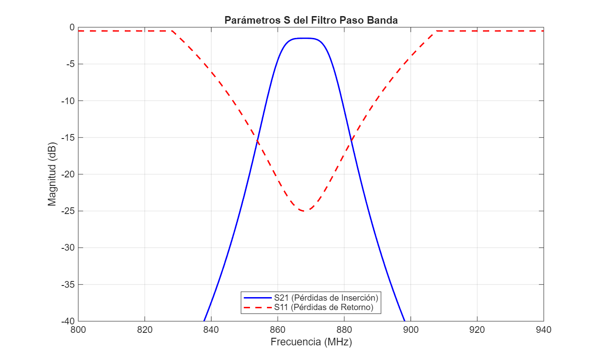

# Análisis y Respuesta en Frecuencia de Filtro Paso Banda

Este repositorio contiene un modelo de caracterización para evaluar los parámetros de dispersión ($S_{11}$ y $S_{21}$) de una red selectiva de RF centrada en la banda ISM de 868 MHz.

## Resultados de Simulación

A continuación se muestra la respuesta en transmisión y reflexión obtenida tras el barrido frecuencial:

### Métricas Clave Obtenidas
* **Frecuencia Central ($f_0$):** 868 MHz
* **Ancho de Banda a 3 dB:** 20 MHz
* **Pérdidas de Inserción en banda de paso:** < 1.5 dB
* **Adaptación de Impedancias ($S_{11}$):** < -20 dB en $f_0$

## Estructura del Repositorio
* `src/`: Scripts de simulación numérica en MATLAB (`filtro_pasobanda.m`).
* `img/`: Gráficas y figuras exportadas para documentación técnica.